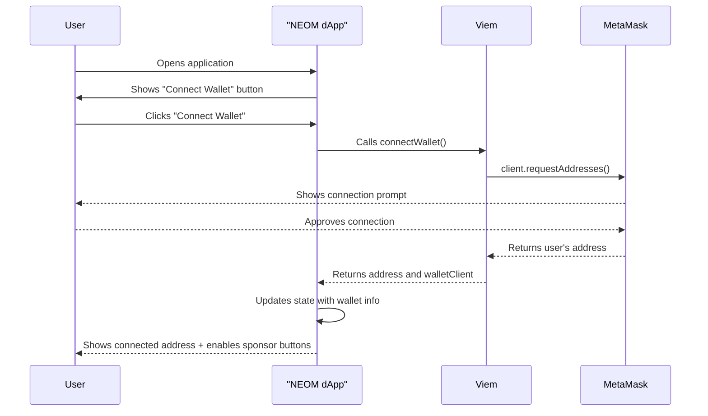

# Chapter 1: Web3 Wallet Connection Implementation

## Overview

This implementation successfully adds Web3 wallet connection functionality to the NEOM social media/NFT app built with Next.js. The goal was to enable users to connect their MetaMask wallet and unlock interactive features like sponsoring content creators.

## Features Implemented

### 🔗 Wallet Connection
- **Connect Wallet Button**: Users can connect their MetaMask wallet via a button in the app header
- **Real MetaMask Integration**: Properly integrates with MetaMask browser extension with user confirmation prompts
- **Wallet State Management**: The app maintains wallet connection state across the application
- **Address Display**: Once connected, the user's wallet address is displayed in a shortened format (e.g., `0x1234...5678`)
- **Connection Status**: Visual indicators show when the wallet is connected
- **Disconnect Functionality**: Users can disconnect their wallet through a dropdown menu
- **Auto-Reconnection**: App automatically detects and reconnects to previously connected wallets
- **Account Change Detection**: Automatically updates when user switches accounts in MetaMask

### 💰 Sponsor Functionality
- **Sponsor Buttons**: Each post now includes a "Sponsor Author" button
- **Smart Enabling**: Sponsor buttons are only enabled when a wallet is connected
- **User Feedback**: Clear messaging indicates why buttons are disabled when wallet is not connected
- **Action Logging**: Console logging for sponsor actions (ready for blockchain integration)

## Technical Implementation

### Core Files Created/Modified

#### 1. **`lib/wallet.ts`** - Wallet Connection Logic
```typescript
// Core wallet connection functions using viem
export async function connectWallet(): Promise<{ account: Address; walletClient: WalletClient } | null>
export function formatAddress(address: Address): string
export interface WalletState
```

#### 2. **`components/wallet-connect.tsx`** - Wallet Connection Component
```typescript
// React component for wallet connection UI
export function WalletConnect({ onConnectionChange, currentWalletState }: WalletConnectProps)
```

#### 3. **`data/posts.ts`** - Post Data Structure
```typescript
// Centralized post data with TypeScript interfaces
export interface Post
export const posts: Post[]
```

#### 4. **`app/page.tsx`** - Main App Integration
- Added wallet state management to main app component
- Integrated wallet connection into the HomeSection header
- Added sponsor buttons to FeedSection posts
- Implemented wallet-aware UI states

### Key Technologies Used

- **Viem**: Modern TypeScript library for Ethereum interactions
- **React State Management**: useState hooks for wallet state
- **TypeScript**: Full type safety for wallet and post interfaces
- **Next.js**: Server-side rendering and modern React features
- **MetaMask Integration**: Browser wallet connection

## User Experience Flow



## Application States

### 🔴 Disconnected State
- **Header**: Shows "Connect Wallet" button
- **Posts**: Sponsor buttons are disabled with message "Connect Wallet to Sponsor"
- **Styling**: Disabled buttons have muted appearance
- **MetaMask**: No connection to wallet extension

### � Connecting State
- **Header**: Shows "Connecting..." button with disabled state
- **MetaMask**: Extension popup appears requesting user approval
- **User Action**: User must approve connection in MetaMask
- **Error Handling**: Graceful handling if user rejects connection

### �🟢 Connected State  
- **Header**: Shows shortened wallet address with green indicator and dropdown menu
- **Posts**: Sponsor buttons are enabled with full functionality
- **Styling**: Active gradient styling on enabled buttons
- **MetaMask**: Connected to specific account address
- **Disconnect Option**: Clickable address shows disconnect option

### 🔄 Account Change Detection
- **Auto-Update**: Automatically detects when user changes accounts in MetaMask
- **Seamless Transition**: Updates displayed address without requiring reconnection
- **State Sync**: All UI elements update to reflect new account state

## Next Steps for Future Chapters

The implementation provides a solid foundation for future Web3 features:

1. **Smart Contract Integration**: The `walletClient` is stored and ready for transaction signing
2. **USDC Sponsorship**: Sponsor buttons can be connected to actual USDC transfers
3. **Transaction Handling**: Error handling and success feedback for blockchain transactions
4. **Gas Estimation**: Transaction cost estimation before execution
5. **Multi-Chain Support**: Easy extension to other blockchain networks

## Running the Application

1. **Install Dependencies**: `npm install` (viem already included)
2. **Start Development Server**: `npm run dev`
3. **Open Browser**: Navigate to `http://localhost:3000`
4. **Connect Wallet**: Click "Connect Wallet" and approve MetaMask connection
5. **Test Sponsor**: Try clicking sponsor buttons on posts

## Code Quality Features

- ✅ **Full TypeScript Support**: All components and functions are fully typed
- ✅ **Error Handling**: Graceful handling of wallet connection failures
- ✅ **Responsive Design**: Wallet components work on all screen sizes
- ✅ **State Management**: Clean separation of wallet state from UI components
- ✅ **Reusable Components**: Modular wallet connection component
- ✅ **Development Ready**: Hot reload and fast refresh support

## Browser Compatibility

- ✅ **Chrome/Chromium**: Full MetaMask support
- ✅ **Firefox**: MetaMask browser extension
- ✅ **Edge**: MetaMask browser extension
- ⚠️ **Safari**: Requires MetaMask mobile app or compatible wallet

## Security Considerations

- **No Private Keys**: App never accesses or stores private keys
- **User Consent**: All wallet interactions require explicit user approval
- **Address Only**: Only public wallet address is stored in application state
- **Client-Side Only**: No sensitive wallet data sent to servers

---

The implementation successfully demonstrates modern Web3 UX patterns while maintaining the existing app's design aesthetic and functionality. Users can seamlessly connect their wallet and interact with sponsor features, setting the stage for full decentralized sponsorship functionality in future chapters.
